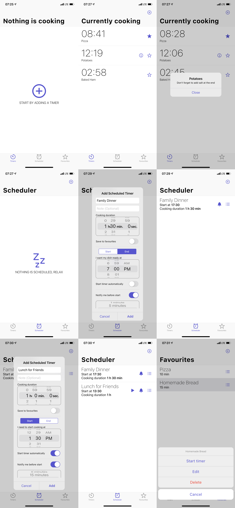

# Qkrio

_The only timer application you will ever need for cooking!_

Qkrio allows you to set timers for multiple dishes you are currently cooking. Once the timer runs out, you will get a friendly notification that your dish is ready to be served.

Are you preparing a dish often and do not want to set timers every time from the start? Save the timer to favourites and next time start it easily. This way you will never forget how much time certain specialty needs. You can also save notes to a certain timer so you don’t forget certain peculiarities.

Are your friends or family coming over for lunch and don't want to forget to start cooking in time? Set a reminder for when you want to start cooking and how much earlier you want to receive a notification. Also, you can set the time you want your dish to be cooked and Qkrio will notify you when you need to start cooking.

## Feature suggestion or bug report

Every feature suggested or bug reported is highly appreciated. We are humans to and can miss an essential component that Qkrio could have, or even break something. In both cases, you can leave your response in the [Issue section](https://github.com/stelynx/qkrio/issues/new/choose).

## Privacy Policy

Privacy policy for Qkrio is available [here](PRIVACY_POLICY.md).

## License

The source code is licensed under [Apache 2.0](LICENSE).
